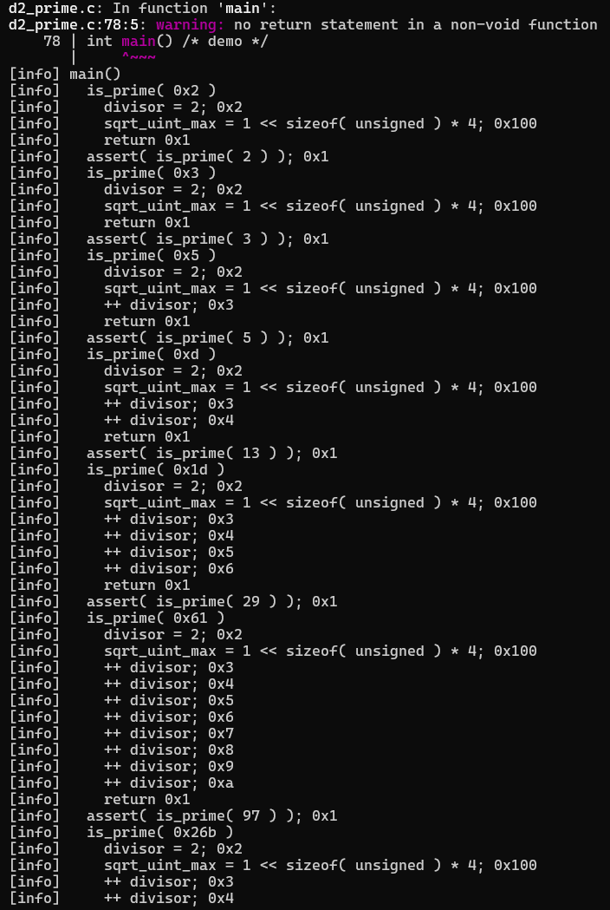
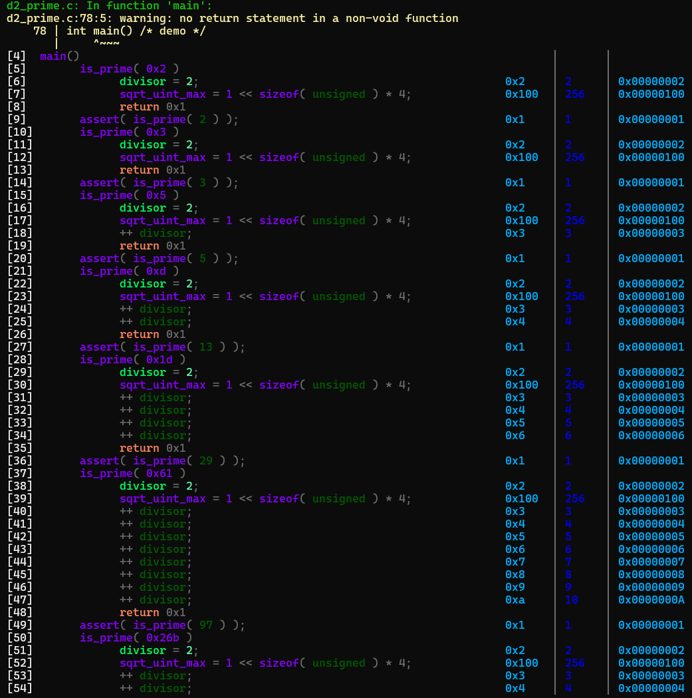

# ccr - TinyCC Debug Output Colorizer

### Author: [Sim Admiral](https://github.com/SimAdmiral)  
## PB111 Project

This project provides a simple wrapper script (`ccr`) around TinyCC (`tinycc`) that automatically runs a specified C source file and pipes its standard output and standard error through a Python script (`colorizer.py`). The Python script then enhances the readability of the output, especially TinyCC's debug `[info]` messages, by adding syntax highlighting and structure.

## Features

*   **TinyCC Integration:** Easily run your C code using the `ccr` script, which leverages TinyCC's `--run` functionality.
*   **Intelligent Highlighting:** `colorizer.py` applies syntax highlighting based on patterns commonly found in compiler output and TinyCC's `[info]` messages, including:
    *   Warnings, Errors, Debug messages
    *   `.c` file names
    *   `[info]` lines:
        *   Highlights the `[info]` tag.
        *   Colorizes index numbers (`[<number>]`).
        *   Applies different colors to hex values, converted decimal values, memory addresses, function calls, variables, operators, and other parts of the debug information.
        *   Formats `[info]` lines with alignment and separators (`│`) for better structure.
*   **Interactive Pager Mode:** Use the `-i` flag to view the output in a simple interactive pager, allowing you to scroll through long outputs.
*   **Convenient Installation:** An `install_ccr.sh` script automates checking requirements, copying files, and setting up your PATH.

## Visual Comparison

Below are two screenshots demonstrating the difference between the **raw TinyCC output** and the **colorized output** produced by `ccr`:

<div style="display: flex; justify-content: space-between; align-items: flex-start; gap: 10px;">
  <div style="flex: 1; text-align: center;">
    
    <p><strong>Raw TinyCC Output</strong></p>
  </div>
  <div style="flex: 1; text-align: center;">
    
    <p><strong>Colorized Output</strong></p>
  </div>
</div>

---

## Requirements

Before installing and using `ccr`, ensure you have the following installed on your system:

*   `bash`: The shell script runner (standard on most Linux/macOS).
*   `python3`: The Python interpreter for the colorizer script.
*   `tinycc` (Special software from PB111): The Tiny C Compiler, specifically its `--run` capability.

## Installation

The project includes an installation script (`install_ccr.sh`) to make setup easy.

1.  **Download the files:**
    Clone this repository or download the `ccr`, `colorizer.py`, and `install_ccr.sh` files.

    ```bash
    git clone <repository_url>
    cd <repository_directory>
    ```
    *(Replace `<repository_url>` and `<repository_directory>` with your actual repository details)*

2.  **Make the installer executable:**

    ```bash
    chmod +x install_ccr.sh
    ```

3.  **Run the installer:**

    ```bash
    ./install_ccr.sh
    ```

    *   By default, the installer will place `ccr` and `colorizer.py` in `$HOME/bin`.
    *   You can specify a different installation directory using the `--prefix` option:
        ```bash
        ./install_ccr.sh --prefix /usr/local/bin
        ```
    *   The installer will check for the required dependencies (`bash`, `python3`, `tinycc`).
    *   It will attempt to add the target directory (`$HOME/bin` by default) to your shell's `PATH` environment variable by modifying your `.bashrc` or `.zshrc` file.
    *   **Important:** If the installer modifies your shell configuration file, you will need to `source` it or open a new terminal session for the changes to take effect:
        ```bash
        source ~/.bashrc  # Or ~/.zshrc depending on your shell
        ```

## Usage

The `ccr` script takes a single argument: the C source file you want to run, or a prefix to find the file.

```bash
ccr - TinyCC runner with debug output highlighter
Author: Sim Admiral
Project: PB111 - Code Highlighter

Usage: ccr <week_number> <filename | filename.c | prefix> [-i]

  <week_number>  Two-digit week number (e.g., 00, 12)
  <filename>     Source file, full filename, or prefix
  -i             interactive mode (uses -i flag in colorizer.py)
  otherwise      runs in normal mode
```
